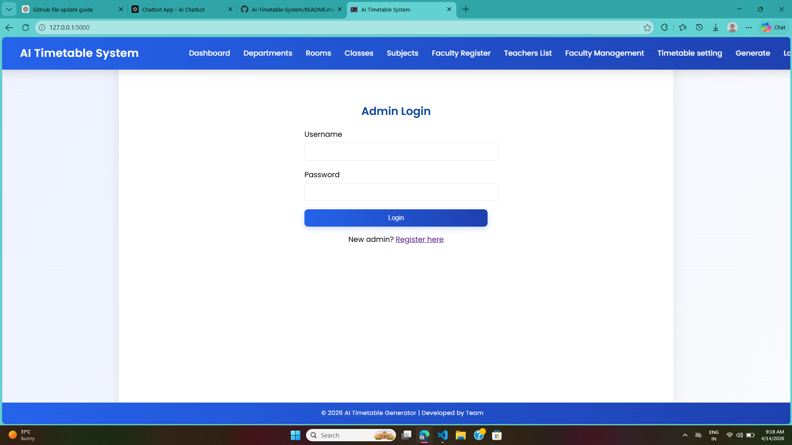
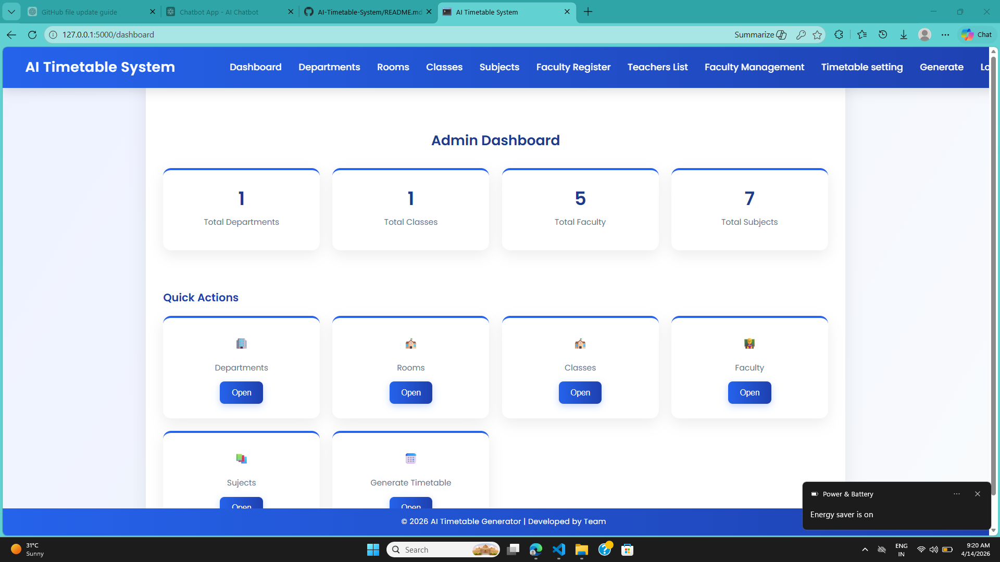
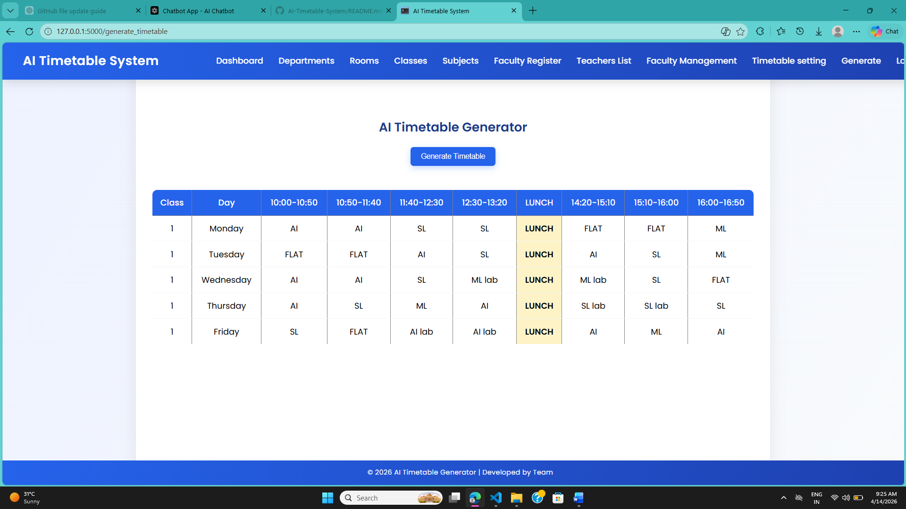
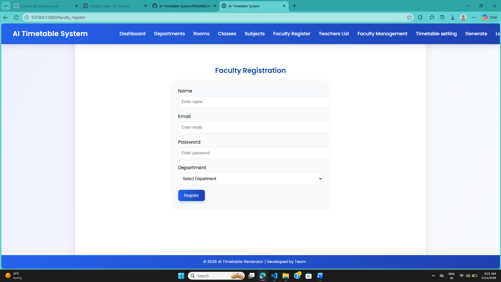
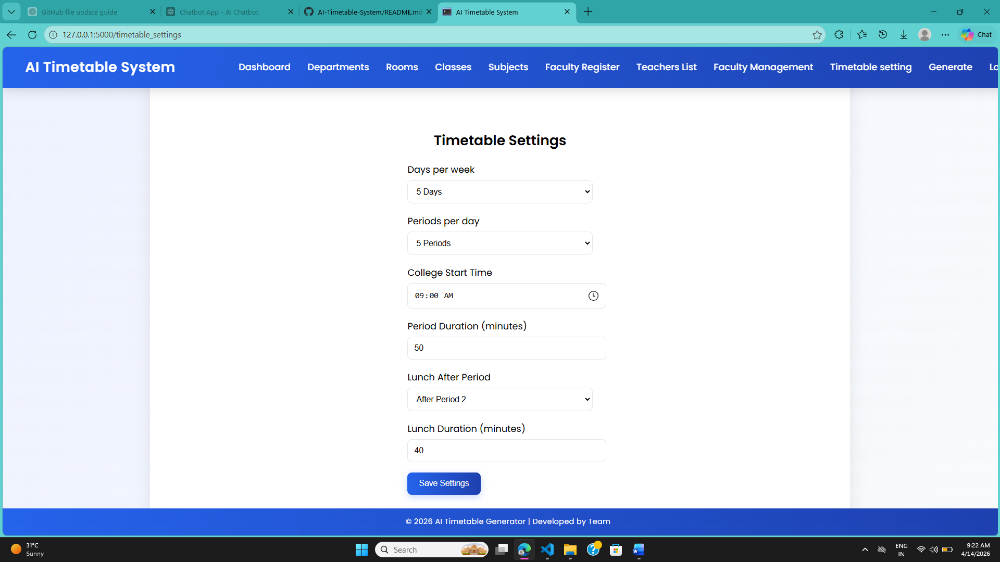

#  AI-Based Smart Timetable Generator

 Developed as part of Hackathon Project

---

##  Problem Statement

Creating a timetable manually in colleges or schools is a complex and time-consuming task. It often leads to issues like:

* Teacher scheduling conflicts
* Room allocation clashes
* Inefficient time utilization

---

## Solution

This project provides an automated timetable generation system that efficiently assigns classes, teachers, and rooms while avoiding scheduling conflicts.

It uses logical rules and constraint-based decision-making to generate an optimized timetable.

---

## Features

*  Automatic timetable generation
*  Conflict-free scheduling
*  Teacher allocation system
*  Room management
*  Simple and user-friendly interface

---

##  AI Concepts Used

* Rule-based decision making
* Constraint satisfaction (avoiding clashes)
* Basic heuristic optimization

---

##  Technologies Used

* Python
* HTML/CSS
* JavaScript (if applicable)

---

##  How to Run

1. Clone the repository
2. Navigate to project folder
3. Run the main file:

```
python main.py
```

---


##  Output

### Admin login


### Dashboard View


### Generated Timetable


### Teacher Register


### Tiemtable setting

---

##  Future Improvements

* Add advanced AI/ML optimization
* Improve UI/UX
* Deploy as a web application

---

##  Author

Anuradha kumari jha

---
